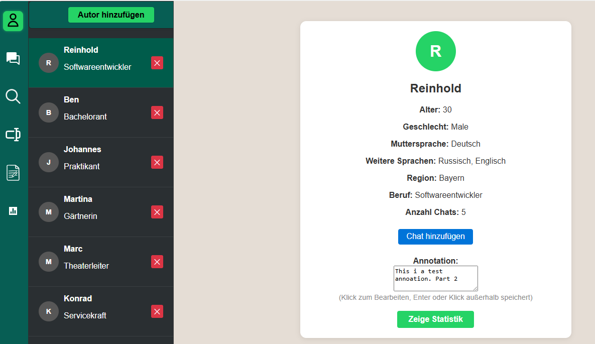
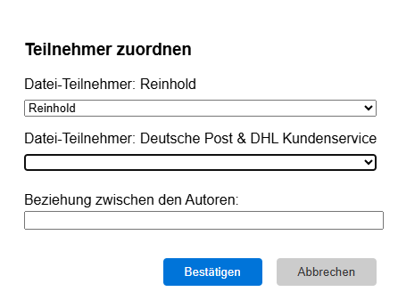
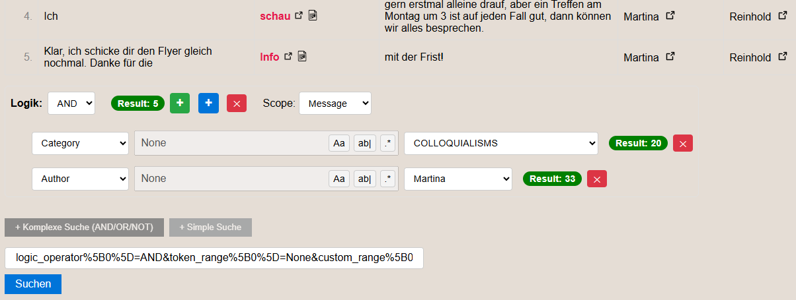
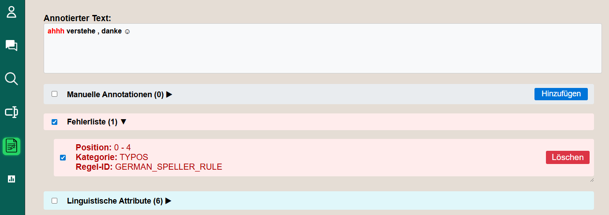
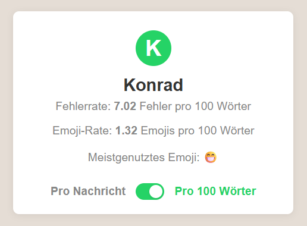

# Query-Enabled Annotation Framework for Text Processing

## Table of Contents
- [About](#about)
- [Features](#features)
- [Installation](#installation)
- [Requirements](#requirements)
- [Running the LanguageTool Server](#running-the-languagetool-server)
- [Running the Flask Application](#running-the-flask-application)
- [Usage](#usage)
  - [Profile](#profile)
  - [Chats](#chats)
  - [Search](#search)
  - [Konkordanz](#konkordanz)
  - [Annotation](#annotation)
  - [Metrics](#metrics)
  - [Settings](#settings)


## About
This project provides a lightweight framework for the automatic and manual annotation of text data, with a focus on instant messaging corpora (e.g., WhatsApp).  
It integrates **[spaCy](https://spacy.io/)** for linguistic annotation, **[LanguageTool](https://languagetool.org/)** for error detection, and a **[Flask](https://flask.palletsprojects.com/) web interface** for exploration.  
Unlike standalone NLP tools, the framework includes a **query-enabled design** that allows researchers to filter, analyze, and retrieve text and annotations efficiently.

---

## Features

- **Automatic annotation**  
  - Part-of-speech, morphology, syntax (via spaCy)  
  - Error detection (via LanguageTool)  

- **Manual annotation**  
  - Researchers can refine or correct automatic annotations  
  - Supports scope, reason, and comments  

- **Query-enabled interface**  
  - Retrieve all messages with errors  
  - Filter by author  
  - Count emoji or punctuation usage  
  - SQL-like queries without requiring deep SQL knowledge  

- **Performance optimizations**  
  - In-memory caching for faster repeated queries  
  - Parallel processing for annotation tasks  

- **Lightweight deployment**  
  - SQLite backend (no separate DB server required)  
  - Flask-based UI
 
- **Offline operation**  
  - All annotation and querying is done locally  
  - No internet connection or external APIs required  
  - Suitable for sensitive or private data (e.g., chat corpora)

---

## Installation

Navigate in the main project and execute the following commands:

Install `virtualenv`

    pip3 install virtualenv

Create environment called `venv`

    python3 -m venv venv

Activate the environment:

    # Windows
    ./venv/Scripts/activate

    # Linux
    source ./venv/bin/activate

Install python libs

    pip install -r requirements.txt

## Requirements

- **Java 17** is required to run the LanguageTool server. LanguageTool analyses the errors from the inputed text and annotates them. 

## Running the LanguageTool Server

This project uses **LanguageTool version 6.6**.

LanguageTool can be downloaded from the official website:  
[https://languagetool.org/download/](https://languagetool.org/download/)

After downloading and extracting the archive, navigate into the extracted directory with the commandline:

```bash
cd LanguageTool-6.6
```
After downloading the `languagetool-server.jar`, you can start the server with:

```bash
java -cp languagetool-server.jar org.languagetool.server.HTTPServer --port 8081
```

## Running the Flask Application

In the main project directory, start the Flask application by running:

    python runFlask.py

Once the server is running, open your browser and go to:
http://localhost:5000

You will be automatically redirected to the `/profile` route, which acts as the entry point to this application.

## Usage

Once the Flask app is running, the navigation bar contains the following views:

### Profile 
*Route (`/profile`)*

Displays profile information for imported authors. Allows you to import chats and select an author.

After clicking on an author in the sidebar, the profile card for that author is displayed, which can be seen in the image below. Additionally, this selects the author and is important for the chat view.



Clicking on the **'Autor hinzufügen'** button opens a form where the user can type in basic information about an author, such as name, age, gender, primary and additional languages, region, and profession. 

Clicking on the **'Zeige Statistik'** button jumps to the route `/metrics/author_id` and shows the metrics to the selected author.

To import a chat the user has to click on the **'Chat hinzufügen'** button. After selecting a txt-file, which should contain the chat, the following form opens.

The author can be annotated as well. Just type in the textfield and leave it to save the author annotation.



The application extracts the authors from the imported chat. If the author is already known and could be identified the program automatically assings it, otherwise the user has to select an author from the drop down menu to assign it manually. The relationship between the authors can be specified in this form as well. After clicking **'Bestätigen'**, the program saves the messages and starts to analyze them and shows the progress in a loading bar. After it is finished the user gets informed.

### Chats
*Route: (`/chat`)*

Shows the imported chats from the perspective of the selected author.

In this view, you can select chats belonging to the active author. Each chat displays the initial of the chat partner, the beginning of the latest message, and its timestamp. 

Clicking on a chat allows you to view all messages from the corresponding chat, and the banner shows the relationship between the authors. 


### Search
*Route: (`/search`)*

Provides a simple search to find substrings in messages. You can choose the author whose messages you want to search.


The searched keyword is highlighted in yellow in the results. Each result shows who wrote the message, who it was sent to, and two icons. The first icon lets you jump to the chat view to see the message in context. The second icon takes you to the annotation view, where you can manage the annotations for that message.

### Konkordanz
*Route: (`/konkordanz`)*

Lets you create complex search queries and view the results in a concordance view.

### Complex and Simple Search
At first, the view displays only two buttons: one to create a **complex search** and one to create a **simple search**.

#### Complex Search
A complex search can use one of three operations: **AND**, **OR**, or **NOT**. Additionally, you can select a **scope**, which determines the range in which the found tokens are considered valid and displayed in the results list.  

Each complex search has three buttons:  
- **Green plus (+)**: adds another complex query within this one  
- **Blue plus (+)**: adds a simple query within this complex query  
- **Red cross (×)**: deletes the complex query

#### Simple Search
A simple search consists of a **search category** and a **search value**.  

- The value can be entered in a text field, for example for a word search. Word searches have additional parameters: **substring search**, **case-sensitive**, and **regular expression**.  
- Alternatively, the value can be selected from a drop-down menu containing specific options for the chosen search category.  

A simple search can also be deleted by clicking the **cross button** on the right. All the discussed elements can be seen in the following image.


After creating a query and clicking on the **'Suchen'** button, the results are calculated and displayed in a concordance view, as illustrated in the image below. The results are displayed in a numbered list. Each result has a left context, the matched part, a left context, the name of the sender, and the name of the recipient. In addition, there are icons which trigger different actions. Right to the matched word is an icon to jump into the chat view and an icon to jump into the annotation view. It is also possible to jump to the authors or recipients profile card, by clicking on the icon on the right side of the name. 

Below the results list, the exectuted query is displayed , along with the result count for each simple query. You can modify and re-execute the query here without reconstructing it from scratch.  



### Annotation
*Route: `/annotation`*

Enables adding or updating annotations for selected messages.  

Annotations are divided into three groups: **manual**, **error**, and **linguistic**. Each group can be expanded to show individual elements. Clicking on a checkbox highlights the corresponding text in the textbox above, as shown in the image below. Additionally, hovering over the highlighted text displays a tooltip with the annotation reason.



Clicking the **'Hinzufügen'** button opens a form where you can add an annotation with attributes such as the text segment, annotation type, reason, and an optional comment. The position can be filled automatically by highlighting the part of the message with the mouse. After clicking **'Speichern'**, the annotation is saved.

Clicking the **'Löschen'** button on an element removes it from the list and deletes the annotation.

### Metrics
*Route: (`/metrics`)*

Displays basic author metrics such as emoji usage and error rate. These can be shown relative to every 100 words or per message.

Similar to the Profile view, you can select each author individually to view their collected metrics.



### Settings
*Route: (`/settings`)*

Currently in development. In the future, this will allow customization of font and color.


